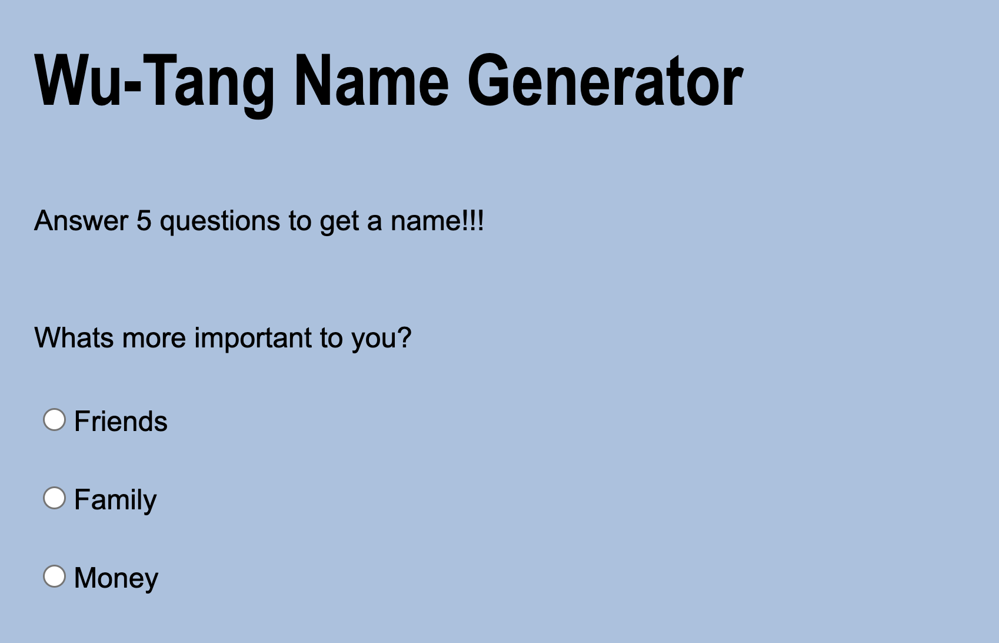

# 🎤 Wu-Tang Name Generator

An interactive **Wu-Tang Clan name generator** that asks you a few survey questions and creates a Wu-Tang-sounding name just for **YOU**. 🥷

## 📸 Project Preview

<!-- Add your screenshot below -->


Users answer **5 survey questions**, and based on their answers the app randomly generates a Wu-Tang-style name.

## ✨ Features

- 📝 Answer 5 survey questions
- 🎲 Randomly generate a Wu-Tang-sounding name
- 🥷 Get a different name based on your answers
- ⚡ Dynamically display the result on the page
- 🖥️ Includes a Node.js server
- 📱 Simple and user-friendly interface

## 🛠️ Built With

- HTML
- CSS
- JavaScript
- Node.js

## 💡 What I Learned

This project gave me more practice turning user input into dynamic results on a webpage.

I also gained more experience working with:
 
- DOM manipulation
- Arrays and objects
- Randomization with `Math.random()`
- Conditional logic
- Building a basic Node.js server
- Organizing HTML, CSS, and JavaScript files

One of the biggest takeaways was learning how to combine **user answers with randomization** to create a unique result each time.

## 🚀 Running the Project

To run this project locally:

1. Clone the repository:

```bash
git clone https://github.com/smayanja3/wuTang-generator.git
```

2. Navigate into the project folder.

3. Start the server:

```bash
node server.js
```

4. Open the local address shown in your terminal in your browser.

5. Answer the questions and get your Wu-Tang name! 🎤

---

Thanks for checking out my project! 🎤🥷✨